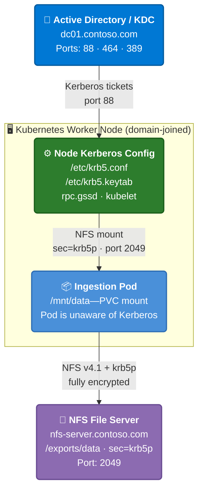

# Network File System (NFS) with Kerberos authentication overview for Agents and Tools with Foundry Local

Agents and Tools with Foundry Local can ingest documents from an on-premises Network File System (NFS) file share by using Kerberos authentication (`krb5p`). Instead of passing a UID/GID to access files, Agents and Tools with Foundry Local uses your Active Directory infrastructure to authenticate securely, with full encryption of data in transit.

This article applies to Agents and Tools with Foundry Local on Azure Local (Arc-enabled Kubernetes).

[!INCLUDE [preview-notice](includes/preview-notice.md)]

## How it works

Kerberos configuration lives on the Kubernetes worker node, not inside the pod. The pod reads files from a mounted directory and has no awareness of Kerberos. The node's kernel (`rpc.gssd`) handles all ticket acquisition and encrypted NFS communication transparently.

### Key design points

- **No passwords stored**- authentication uses a keytab file on the node.
- **Data encrypted in transit**- `krb5p` provides full NFS payload encryption.
- **Pod is Kerberos-unaware**- the kernel handles everything via `rpc.gssd`.
- **Continuous health monitoring**- a DaemonSet validates each node every 60 seconds and labels it ready or not ready.
- **Node affinity**- ingestion pods only schedule on nodes that pass validation.

## What happens during ingestion

When you create an NFS data source with Kerberos authentication:

1. **Ingestion API** receives the request with `uid=0, gid=0` (sentinel values for Kerberos mode).
1. **Preflight check** queries for nodes with `edge-rag/kerberos-ready=true` and raises an error if no nodes are found.
1. **PV/PVC creation** creates a static PersistentVolume with `mount_options: ["sec=krb5p", "vers=4.1"]`.
1. **Pod scheduling** uses node affinity to land the pod on a `kerberos-ready=true` node.
1. **Mount**- kubelet on the node triggers the NFS mount, and `rpc.gssd` intercepts and obtains a Kerberos ticket from the keytab.
1. **File access**- the pod reads `/mnt/data` as a normal directory with no Kerberos code in the pod.

## Prerequisites checklist

Complete every item before installing Agents and Tools with Foundry Local with Kerberos enabled. All items are required unless noted.

| # | Prerequisite | Who | Validation command |
|---|---|---|---|
| **Azure / Cluster** | | | |
| 1 | Azure Local Arc-enabled Kubernetes cluster operational | Platform Admin | `kubectl get nodes`- all nodes `Ready` |
| 2 | Active Directory domain available (with Key Distribution Center (KDC)) | AD Admin | `nslookup -type=SRV _kerberos._tcp.contoso.com` |
| 3 | Worker nodes joined to AD domain | AD Admin | `realm list`- shows `configured: kerberos-member` |
| 4 | Kerberos client packages installed (`krb5-user` or `krb5-workstation`) | Node Admin | `kinit --version` |
| 5 | `/etc/krb5.conf` configured on every worker node | Node Admin | `grep default_realm /etc/krb5.conf` |
| 6 | NFS service principal created in AD | AD Admin | `klist -kt /etc/krb5.keytab` |
| 7 | Keytab exported and deployed to every worker node at `/etc/krb5.keytab` | AD Admin | `sudo kinit -kt /etc/krb5.keytab <SPN>` |
| 8 | `nfs-common` (Debian) or `nfs-utils` (Red Hat Enterprise Linux (RHEL)) installed | Node Admin | `dpkg -l nfs-common` or `rpm -q nfs-utils` |
| 9 | `rpc-gssd` service enabled and running on every worker node | Node Admin | `systemctl is-active rpc-gssd` |
| 10 | NFS server configured for NFSv4.1 with `sec=krb5p` exports | Storage Admin | `showmount -e nfs-server.contoso.com` |
| 11 | NFS server has its own service principal name (SPN) in AD (for example, `nfs/nfs-server@REALM`) | AD Admin | On NFS server: `klist -kt /etc/krb5.keytab` |
| 12 | Forward DNS (A record) for NFS server hostname | Network Admin | `nslookup nfs-server.contoso.com` |
| 13 | Reverse DNS (pointer (PTR) record) for NFS server IP | Network Admin | `nslookup <nfs_server_ip>` |
| 14 | Forward DNS for all domain controllers | Network Admin | `nslookup dc01.contoso.com` |
| 15 | Network Time Protocol (NTP) time synchronization configured (clock skew less than 5 minutes) | Node Admin | `timedatectl status`- `NTP synchronized: yes` |
| 16 | Firewall rules open (see [Network requirements](connect-nfs-kerberos-reference.md#network-requirements)) | Network Admin | `nc -zv dc01.contoso.com 88` |
| 17 | Test NFS mount with `sec=krb5p` succeeds from every worker node | Node Admin | See [Validate NFS Kerberos mount](connect-nfs-kerberos-setup.md#step-6-validate-nfs-kerberos-mount) |
| 18 | Worker nodes labeled `edge-rag/kerberos-provisioned=true` | Platform Admin | `kubectl get nodes -l edge-rag/kerberos-provisioned=true` |

## Portal fields reference

When you install Agents and Tools with Foundry Local via the Azure portal, the **Data Source Connection / Authentication** section includes the following Kerberos fields:

| Portal field | Helm key | Type | Default | Description |
|---|---|---|---|---|
| **Enable Kerberos** | `kerberos.enabled` | Toggle | `false` | Enables Kerberos authentication for NFS data sources. When enabled, the installer validates that at least one node is labeled `kerberos-provisioned=true`. |
| **Service principal name (SPN)** | `kerberos.spn` | Text (required when enabled) | _(empty)_ | The Kerberos SPN for NFS authentication. Format: `nfs/<service_account>@<REALM>`. Example: `nfs/edgerag-svc@CONTOSO.COM`. Must match the principal in the keytab deployed on your nodes. |

> [!IMPORTANT]
> The SPN field is required when Kerberos is enabled. The installation fails with a template error if left empty.

When `kerberos.enabled` is set to `true`, Agents and Tools with Foundry Local:

1. Deploys a Kerberos Validator DaemonSet on every node (health checks every 60 seconds).
1. Runs a preinstall validation hook (checks for labeled nodes).
1. Creates a dedicated `kerberos-ingestion-sa` ServiceAccount with PV/PVC permissions.
1. Uses PVC-based NFS mounts with `sec=krb5p,vers=4.1` (instead of inline NFS volumes).
1. Schedules ingestion pods only on `kerberos-ready=true` nodes.

The `kerberos.spn` value is injected into the ingestion API pod as the `KERBEROS_SPN` environment variable. The system uses this value for logging and validation. The keytab on the node handles the actual Kerberos authentication.

## Frequently asked questions

**Does the pod need any Kerberos libraries or configuration?**
No. The pod is unaware of Kerberos. The `rpc.gssd` service on the node handles all authentication. The pod reads files from a mounted directory.

**Can I use an IP address for the NFS server?**
No. Kerberos requires a hostname for SPN construction. Use the NFS server's FQDN (for example, `nfs-server.contoso.com`).

**What if my NFS server only supports NFSv3?**
NFSv3 doesn't support Kerberos authentication. You must upgrade to NFSv4.1 or later, or use UID/GID authentication instead.

**Can I mix Kerberos and UID/GID data sources?**
Yes. When `kerberos.enabled=true`, you can still create UID/GID-based NFS data sources by providing nonzero UID and GID values. Kerberos is used only when the authentication method is set to **Kerberos** in the UI (which sends UID=0, GID=0 as sentinel values).

**What happens if a node loses its keytab or rpc.gssd stops?**
The DaemonSet validator detects the issue within 60 seconds and sets the node to `kerberos-ready=false`. Ingestion pods aren't scheduled on that node. Existing pods on the node might fail their next NFS mount. The files are redelivered from Redis and processed by a healthy node.

**How do I remove a node from Kerberos duty?**
Remove the provisioned label: `kubectl label node <node_name> edge-rag/kerberos-provisioned-`. The DaemonSet continues to run, but the node isn't considered for new ingestion workloads once `kerberos-ready` is set to false.

## Next step

> [!div class="nextstepaction"]
> [Set up Kerberos authentication](connect-nfs-kerberos-setup.md)
