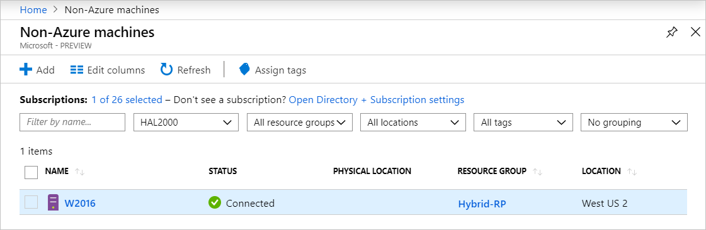

# Connect hybrid machines to Azure by using Azure PowerShell

You can use Azure PowerShell to onboard your machines to Azure Arc-enabled servers. Use the Azure PowerShell cmdlet [Connect-AzConnectedMachine](/powershell/module/az.connectedmachine/connect-azconnectedmachine) to download the Azure Connected Machine agent, install the agent, and register the machine with Azure Arc. The cmdlet downloads the Windows agent package (Windows Installer) from the Microsoft Download Center or the Linux agent package from the Microsoft package repository.

This article guides you through installing the agent on the target machine. You can install the agent directly or by deploying it remotely, using [PowerShell remoting](/powershell/scripting/learn/ps101/08-powershell-remoting), from another system.

Before you start, review the [Azure Arc-enabled servers prerequisites](prerequisites.md) and verify that your subscription and resources meet the requirements. For information about supported regions and related considerations, see [supported Azure regions](overview.md#supported-regions).

If you don't have an Azure subscription, create a [free account](https://azure.microsoft.com/pricing/purchase-options/azure-account?cid=msft_learn) before you begin.

## Prerequisites

- A Windows or Linux machine that you want to connect to Azure Arc.

- Administrator permissions on the machine to install and configure the agent. On Linux, use the root account, and on Windows, be a member of the Local Administrators group.

- Azure PowerShell installed on the target machines. For instructions, see [Install and configure Azure PowerShell](/powershell/azure/).

- The `Az.ConnectedMachine` module installed on the machine you want to connect. Run the following command on the machine:

   ```powershell
   Install-Module -Name Az.ConnectedMachine
   ```

## Install the agent and connect to Azure

Complete the following steps to install the agent directly on the machine.

1. Open a PowerShell console with elevated privileges.

1. Sign in to Azure by running the command `Connect-AzAccount`.

1. To install the Connected Machine agent, use `Connect-AzConnectedMachine` with the `-Name`, `-ResourceGroupName`, and `-Location` parameters. Use the `-SubscriptionId` parameter to override the default subscription as a result of the Azure context created after sign-in. Run one of the following commands:

    - To install the Connected Machine agent on a target machine that can directly communicate to Azure, run:

        ```azurepowershell
        Connect-AzConnectedMachine -ResourceGroupName myResourceGroup -Name myMachineName -Location <region>
        ```

    - To install the Connected Machine agent on a target machine that communicates through a proxy server, run:

        ```azurepowershell
        Connect-AzConnectedMachine -ResourceGroupName myResourceGroup -Name myMachineName -Location <region> -Proxy http://<proxyURL>:<proxyport>
        ```

      The agent uses this configuration to communicate through the proxy server by using the HTTP protocol.

If the agent fails to start after setup finishes, check the logs for detailed error information. On Windows, check this file: *%ProgramData%\AzureConnectedMachineAgent\Log\himds.log*. On Linux, check this file: */var/opt/azcmagent/log/himds.log*.

## Install and connect by using PowerShell remoting

Complete the following steps to use PowerShell remoting to install the agent on remote systems.

> [!NOTE]
> To configure Windows servers from an Azure Arc–enabled machine, enable PowerShell remoting on each target server by running the `Enable-PSRemoting` cmdlet.

1. Open a PowerShell console as an administrator.

1. Sign in to Azure by running the command `Connect-AzAccount`.

1. To install the Connected Machine agent, use `Connect-AzConnectedMachine` with the `-ResourceGroupName` and `-Location` parameters. The Azure resource names automatically use the hostname of each server. Use the `-SubscriptionId` parameter to override the default subscription as a result of the Azure context created after sign-in.

    - To install the Connected Machine agent on a target machine that can directly communicate to Azure, run the following command:

        ```azurepowershell
        $sessions = New-PSSession -ComputerName myMachineName
        Connect-AzConnectedMachine -ResourceGroupName myResourceGroup -Location <region> -PSSession $sessions
        ```

    - To install the Connected Machine agent on multiple remote machines at the same time, add a list of remote machine names, each separated by a comma.

        ```azurepowershell
        $sessions = New-PSSession -ComputerName myMachineName1, myMachineName2, myMachineName3
        Connect-AzConnectedMachine -ResourceGroupName myResourceGroup -Location <region> -PSSession $sessions
        ```

    The following example shows the results of the command targeting a single machine:

    ```azurepowershell
    time="2025-08-07T13:13:25-07:00" level=info msg="Onboarding Machine. It usually takes a few minutes to complete. Sometimes it may take longer depending on network and server load status."
    time="2025-08-07T13:13:25-07:00" level=info msg="Check network connectivity to all endpoints..."
    time="2025-08-07T13:13:29-07:00" level=info msg="All endpoints are available... continue onboarding"
    time="2025-08-07T13:13:50-07:00" level=info msg="Successfully Onboarded Resource to Azure" VM Id=a0a0a0a0-bbbb-cccc-dddd-e1e1e1e1e1e1

    Name           Location OSName   Status     ProvisioningState
    ----           -------- ------   ------     -----------------
    myMachineName  eastus   windows  Connected  Succeeded
    ```

[!INCLUDE [sql-server-auto-onboard](includes/sql-server-auto-onboard.md)]

## Verify the connection with Azure Arc

After you install and configure the agent to register with Azure Arc-enabled servers, go to the Azure portal to verify that the server connected successfully. View your machine in the [Azure portal](https://portal.azure.com).



## Next steps

- If necessary, see the [Troubleshoot Connected Machine agent guide](troubleshoot-agent-onboard.md).
- Review the [Planning and deployment guide](plan-at-scale-deployment.md) to plan for deploying Azure Arc-enabled servers at any scale and implement centralized management and monitoring.
- Learn how to manage your machine by using [Azure Policy](/azure/governance/policy/overview). You can use VM [guest configuration](/azure/governance/machine-configuration/overview), verify that the machine is reporting to the expected Log Analytics workspace, and enable monitoring with [VM insights](/azure/azure-monitor/vm/vminsights-enable-policy).
