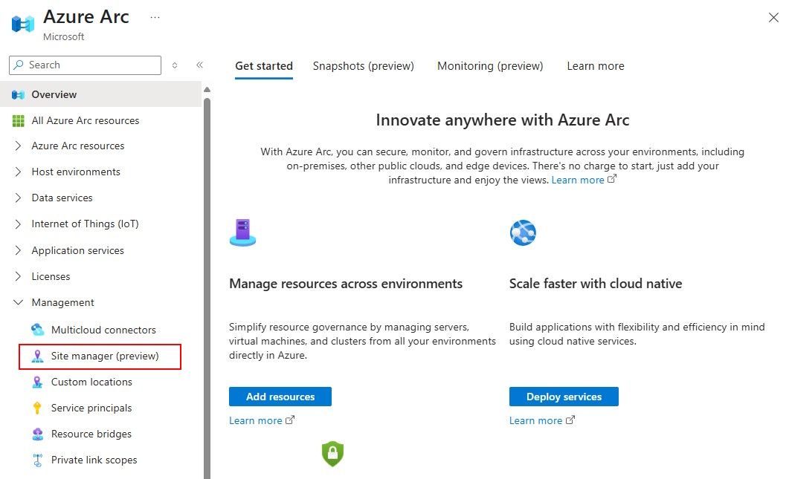
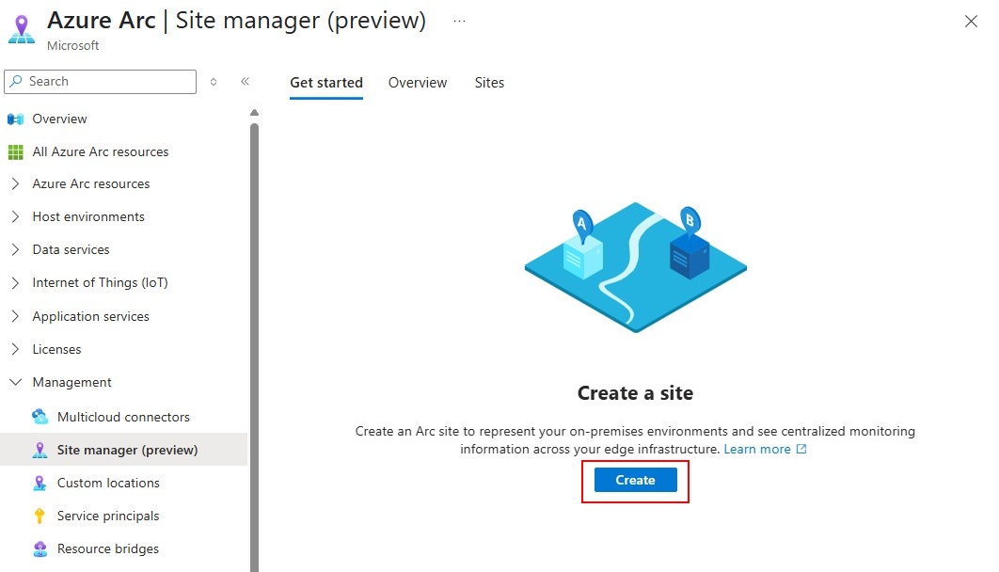
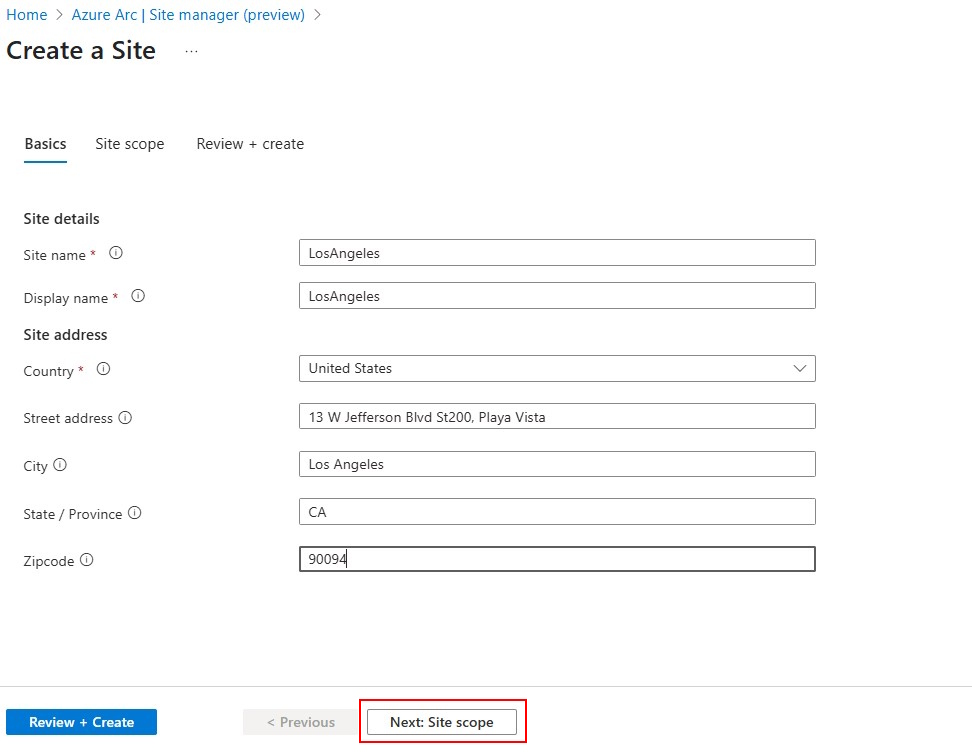
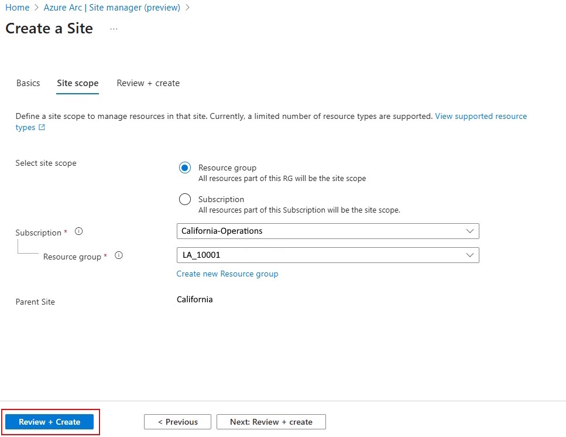
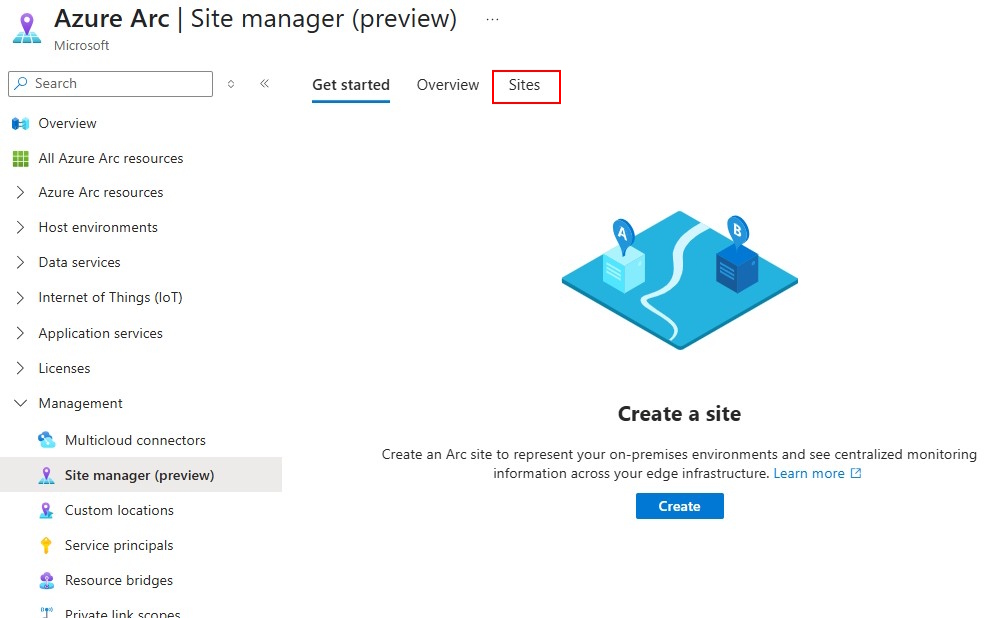
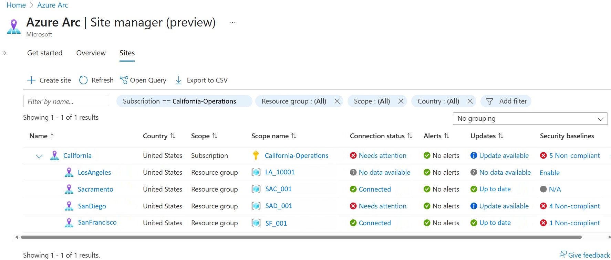

# Create and manage sites

This article guides you through how to create, modify, and delete a site using Azure Arc site manager (preview).

## Prerequisites

* An Azure subscription. If you don't have a service subscription, create a [free trial account in Azure](https://azure.microsoft.com/free/).
* Azure portal access
* Internet connectivity
* A resource group or subscription in Azure with at least one resource for a site. For more information, see [Supported resource types](./overview.md#supported-resource-types).

## Open Azure Arc site manager

In the [Azure portal](https://portal.azure.com), search for and select **Azure Arc**. Select **Site manager (preview)** from the Azure Arc navigation menu.

Alternatively, you can also search for Azure Arc site manager directly in the Azure portal using terms such as **site**, **Arc Site**, **site manager** and so on.

## Create a site

Create a site to manage geographically related resources.

1. From the main **Site manager** page in **Azure Arc**, select the blue **Create a site** button.

   
   
   
   
   
   
1. Provide the following information about your site:

   | Parameter | Description |
   |--|--|
   | **Site name** | Custom name for site. |
   | **Display name** | Custom display name for site. |
   | **Site address**| Physical address for a site. Providing Country is mandatory, while Street address, City, State / Province and Zip code are optional.|
   | **Site scope** | Either **Subscription** or **Resource group**. The scope can only be defined at the time of creating a site and can't be modified later. All the resources in the scope can be viewed and managed from site manager.  |
   | **Subscription / Resource group** | Select the Subscription / Resource group as per the site scope. |
   | **Parent Site**| Subscription scope sites do not have a parent site. Resource Group scope sites can only be a child of the parent Subscription scope site.|
   
1. Once all these details are provided, select **Review + create**.

   
   
   
   
   
   
1. On the summary page, review and confirm the site details then select **Create** to create your site.

   
   
   
   
   
If a site is created from a resource group or subscription that contains resources that are supported by site, these resources will automatically be visible within the created site. 

## View and modify a site

Once you create a site, you can access it and its managed resources through site manager.

1. From the main **Site manager** page in **Azure Arc**, select **Sites** to view all existing sites.

   
   
   
   
   
1. On the **Sites** page, you can view all existing sites. Select the name of the site that you want to delete.

   
   
   
   
1. On a specific site's resource page, you can:

   * View resources
   * Modify resources (modifications affect the resources elsewhere as well)
   * View connectivity status
   * View update status
   * View alerts
   * Add new resources

Currently, only some aspects of a site can be modified. These are as follows:

| Site Attribute | Modification that can be done |
|--|--|
| Display name | Update the display name of a site to a new unique name. |
| Site address | Update the address of a site. |

## Delete a site

Deleting a site doesn't affect the resources, resource group, or subscription in its scope. After a site is deleted, the resources of that site will still exist but can't be viewed or managed from site manager. You can create a new site for the resource group or the subscription after the original site is deleted.

1. From the main **Site manager** page in **Azure Arc**, select **Sites** to view all existing sites.

1. On the **Sites** page, you can view all existing sites. Select the name of the site that you want to delete.

1. On the site's resource page, select **Delete**.

   
   
   
   
