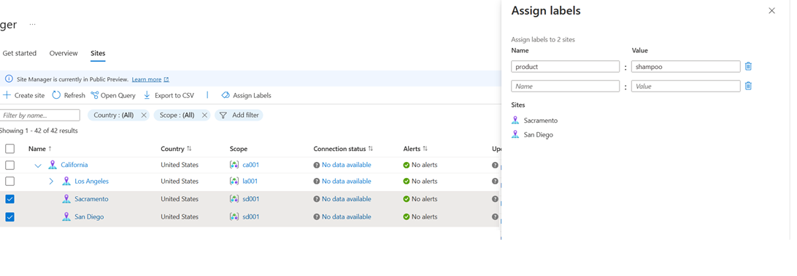
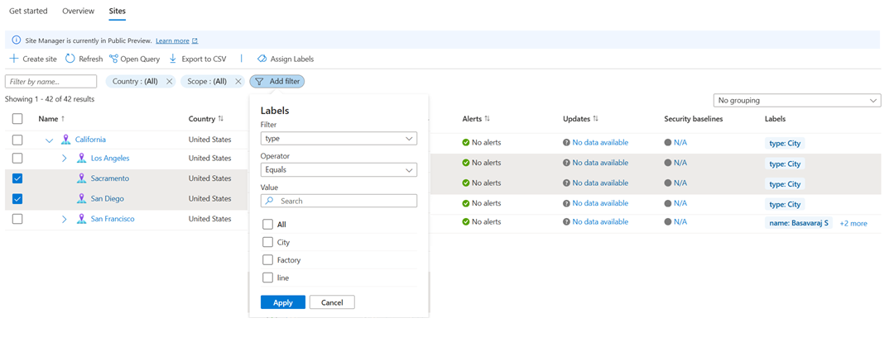

---
# Required metadata
# For more information, see https://learn.microsoft.com/en-us/help/platform/learn-editor-add-metadata
# For valid values of ms.service, ms.prod, and ms.topic, see https://learn.microsoft.com/en-us/help/platform/metadata-taxonomies

title: 'Create and manage labels for an Arc site '
description: 'Create and manage labels for an Arc site '
author:      dawagle # GitHub alias
ms.author:   dawagle # Microsoft alias
ms.service: azure-arc
ms.topic: how-to
ms.date:     12/16/2025
ms.subservice: azure-arc-site-manager
---

# Create and manage labels for an Arc site

Labels enable tagging Azure Arc Sites with metadata for categorization and operations. Labels can be created as key-value pairs (label name: label value).

## Prerequisites 

An Azure subscription. If you don't have a service subscription, create a [free trial account in Azure](https://azure.microsoft.com/free/). 

Azure portal access 

Internet connectivity 

A resource group or subscription or service group in Azure with at least one resource for a site. For more information, see [Supported resource types](https://github.com/dawagle/azure-management-docs-pr/blob/docs-editor/createlabels-1760696724/azure/azure-arc/site-manager/overview). 

A site created for the associated resource group or subscription or service group. If you don't have one, see [Create and manage sites](https://github.com/dawagle/azure-management-docs-pr/blob/docs-editor/createlabels-1760696724/azure/azure-arc/site-manager/how-to-crud-site). 

## Create and Manage labels 

1. From the [Azure portal](https://portal.azure.com/), navigate to Azure Arc and select Site manager to open site manager. 

1. From Azure Arc site manager, navigate to the Sites page.

1. On the Site page, you can see the list of all your sites. Select the sites of choice and click on "Assign Labels".  

1. In the Assign Labels section, define the label name and label value. Multiple labels can be added up to a limit of 15 for an individual site. Multiple values for a single label can be defined using comma-separated values. The character limit for label name and value is 256 and 512 respectively.  

1. Any prior label name: value pair can be deleted to manage the list of labels for selected sites.  

## Filter through labels 

1. From the [Azure portal](https://portal.azure.com/), navigate to Azure Arc and select Site manager to open site manager. 

1. From Azure Arc site manager, navigate to the Sites page.

1. On the Site page, you can see the list of all your sites. The labels associated with a site are listed under the column Labels. 

1. The list of sites in this page can be filtered using the "Add Filter". The label name can be mentioned under filter field while the value field allows a choice of options from the list of label values detected for that label name. 

## Define a site label strategy  

A planned labeling strategy ensures that categorization aligns with business goals and operational needs. You can assess and plan your specific requirements using effective standards.  

**Evaluate categorization needs of the organization.** Your labeling approach must align with organization standards and maintain consistency. Inconsistent tagging creates confusion and reduces the effectiveness of resource management. To ensure your Site labels complement these established practices, review your company's existing naming conventions and governance policies. 

**Identify operational requirements for your sites.** Site labels capture critical operational metadata that supports consumption across partner products to enable identification and associated operations on sites. Labels enable tagging Azure Arc Sites with metadata for categorization and operations. Labels can be created through key-value pairs (label name: label value) Labels enable tagging Azure Arc Sites with metadata for categorization and operations. Labels can be created through key-value pairs (label name: label value).

