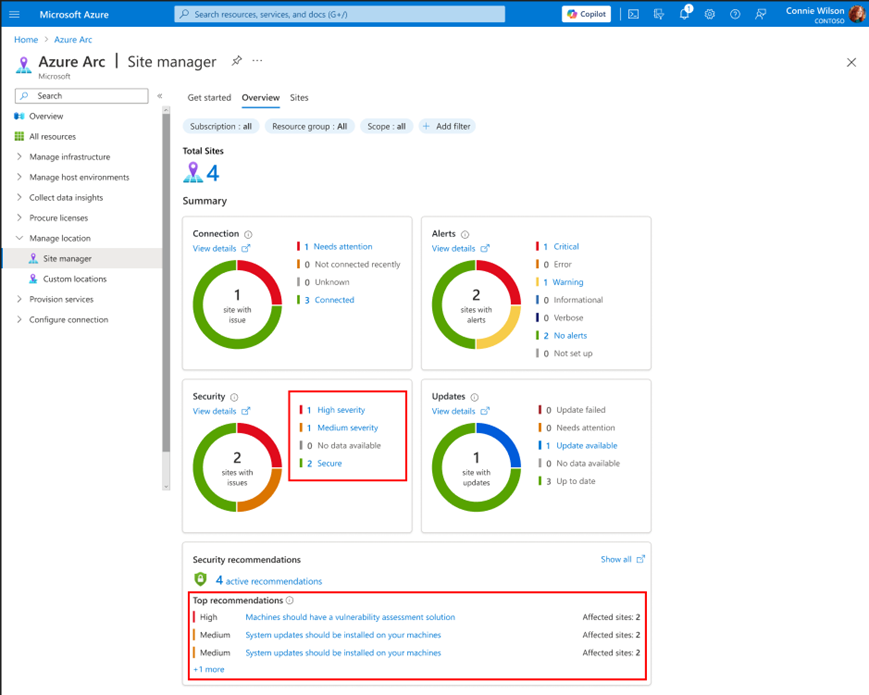
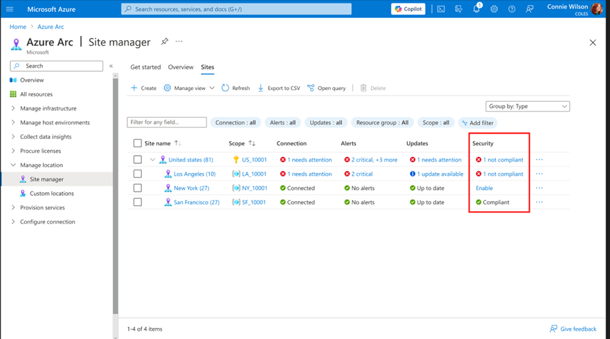
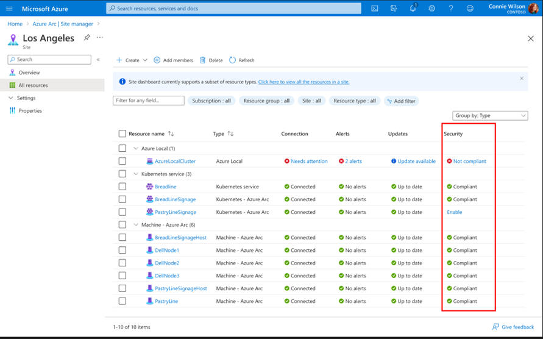
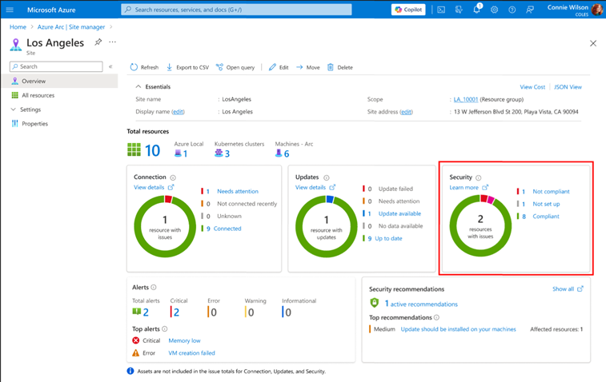
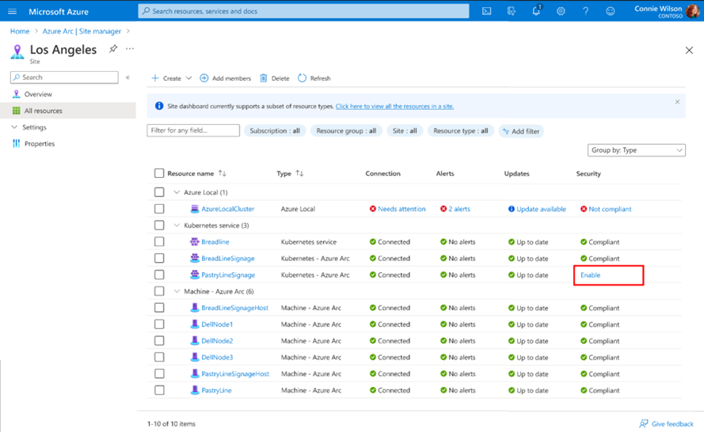
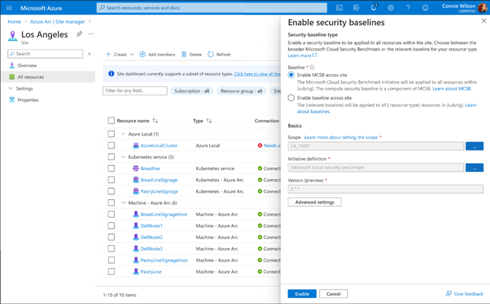
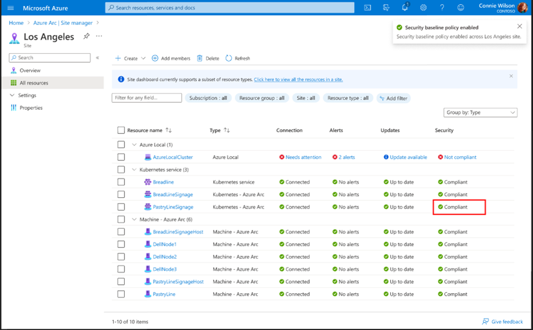

---
# Required metadata
# For more information, see https://learn.microsoft.com/en-us/help/platform/learn-editor-add-metadata
# For valid values of ms.service, ms.prod, and ms.topic, see https://learn.microsoft.com/en-us/help/platform/metadata-taxonomies

title: View security compliance status
description: This article details how to view the security baseline status for an Azure Arc site.
author:      AgarkarNikhil # GitHub alias
ms.author:   nagarkar # Microsoft alias
ms.service: azure-arc
ms.topic: how-to
ms.date:     05/29/2025
ms.subservice: azure-arc-site-manager
---
# How to view compliance status for Azure security baseline

## How to view security baseline status 

This article details how to view the security baseline status for an Azure Arc site. A site's security baseline status reflects the compliance status of the underlying resources to the [Azure compute security baselines](/azure/governance/policy/samples/guest-configuration-baseline-windows). 

### Prerequisites 

- An Azure subscription. If you don't have a service subscription, create a [free trial account in Azure](https://azure.microsoft.com/pricing/purchase-options/azure-account?cid=msft_learn).
- Azure portal access
- Internet connectivity
- A Resource Group or Subscription or Service Group in Azure with at least one resource for a site. For more information, see [Supported resource types](/azure/azure-arc/site-manager/overview).
- A site created for the associated Resource Group or Subscription or Service Group. If you don't have one, see [Create and manage sites](/azure/azure-arc/site-manager/how-to-crud-site). 

### Security status and meanings 

In the Azure portal, status is indicated using color.  

- Green: **Compliant**
- Red: **Non-compliant**
- Blue: **Enable** (security baseline has not yet been enabled)
- Grey: **N/A** – Not Applicable (security baseline is not yet supported for the resource type) 

### View security baseline status 

You can view the security baseline status for an Arc site as a whole from the main page of Azure Arc site manager (preview). 

1. From the [Azure portal](https://portal.azure.com/), navigate to **Azure Arc** and select **Site manager (preview)** to open site manager.
2. From Azure Arc site manager, navigate to the **Overview** page.  

3. On the **Overview** page, you can view the summarized security statuses of your sites. This site-level status is aggregated from the statuses of its managed resources. The security status can be seen with respect to the security baselines and Microsoft Defender for Cloud recommendations. In the following example, sites are shown with different statuses.   

4. To understand which site has which status, select either the **Sites** tab or the blue colored status text to be directed to the **Sites** page.  

5. On the **Sites** page, you can view the top-level status for each site. This site-level status reflects the most significant resource-level status for the site. 

6. Select the **non-compliant** link to view the resource details.  

7. On the site's resource page, you can view the security status for each resource within the site. This list also highlights the specific resources that are non-compliant which contribute to the parent resource being marked as non-compliant. 

 

## How to enable security baseline status 

Azure Arc site manager (preview) provides a centralized view to see security status, but it does not provide security capabilities itself. Instead, customers can set up security baselines via Azure Policy. Once these policies are configured, Azure Arc site manager (preview) shows the relevant status within the site pages. 

If you aren’t familiar with Azure Arc security baselines, learn more about the [compute security baselines](/security/benchmark/azure/security-baselines-overview). 

### Prerequisites 

- An Azure subscription. If you don't have a service subscription, create a [free trial account in Azure](https://azure.microsoft.com/pricing/purchase-options/azure-account?cid=msft_learn).
- Azure portal access
- Internet connectivity
- A Resource Group or Subscription or Service Group in Azure with at least one resource for a site. For more information, see [Supported resource types](/azure/azure-arc/site-manager/overview).
- A site created for the associated Resource Group or Subscription or Service Group. If you don't have one, see [Create and manage sites](/azure/azure-arc/site-manager/how-to-crud-site). 

### Configure security baselines for sites in Azure Arc 

This section provides basic steps for configuring the security baselines from Azure Arc site manager. This can also be done separately via Azure Policy by applying the relevant policy for [Windows](/azure/governance/policy/samples/guest-configuration-baseline-windows) (“[Preview]: Windows machines should meet requirements for the Azure compute security baseline”) or [Linux](/azure/governance/policy/samples/guest-configuration-baseline-linux) (“[Preview]: Linux machines should meet requirements for the Azure compute security baseline”). 

1. Navigate to the individual site page. 

2. Navigate to the 'All Resources' blade.

3. Click into “Enable” for the relevant policy. 

4. Click Apply, or if desired, click Advanced Settings. The policy will be applied to all resources within the scope of the site.

5. The compliance status of each resource to the policy will appear within site manager in 5-10 minutes.  

