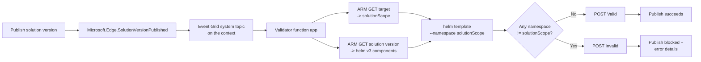

# Namespace validation with an external validator

In this article, you deploy a reference external validator that blocks a workload orchestration solution version from being published when its Helm charts attempt to deploy Kubernetes resources in a cluster namespace other than the one specified in the `--solution-scope` parameter while creating the target. The validator runs as a customer-owned Azure Function that subscribes to the workload orchestration publish event, renders each chart, and reports the result to Azure Resource Manager (ARM).

You learn how to:

> [!div class="checklist"]
> - Deploy the container-based validator function app with a managed identity.
> - Grant the managed identity access to read solution versions and pull charts.
> - Configure the required application settings.
> - Register the external validation Event Grid subscription on your context.
> - Test the validator with compliant and noncompliant charts.

## How it works

When you publish a solution version that has external validation enabled, workload
orchestration emits a `Microsoft.Edge.SolutionVersionPublished` event and holds the version
in a pending state until it receives a callback. The validator performs these actions:

1. Receives the event through an Event Grid subscription on your context's system topic.
2. Reads the **target** and the **solution version** from ARM. The target's `solutionScope`
   is the *effective namespace* the solution is allowed to deploy into.
3. Runs `helm template --namespace <solutionScope>` for every `helm.v3` component and
   inspects the **rendered** manifests for every namespace they reference.
1. Sends a `Valid` or `Invalid` result to the `callbackUrl`. If a rendered resource targets
  a namespace other than `solutionScope`, the validator rejects the version, and publishing
  fails.

The validator is render-only and fail-closed. It always renders the chart. A render failure
or a component with missing chart coordinates causes the validator to reject the version.



## Prerequisites

- An Azure subscription with workload orchestration enabled.
- An existing context and its Event Grid system topic. External validation uses an event
  subscription on this topic.
- Permission to create resource groups, container registries, storage accounts, and function
  apps, and to assign roles. You need the Owner or User Access Administrator role on the target
  scope to assign roles.
- [Azure CLI](/cli/azure/install-azure-cli) set up on your device, with the `eventgrid` extension installed.
- The name of each Azure Container Registry (ACR) instance that hosts your Helm charts.
- The `namespace-validator` reference implementation and `deploy.ps1` script from the
  [workload-orchestration GitHub repository](https://github.com/Azure/workload-orchestration).

## Define the variables

### [Bash](#tab/bash)

```bash
RG=nsvalidator-rg
LOCATION=eastus2
PLAN_LOCATION=centralus            # EP plans need Virtual machine quota in this region
ACR=<yourAcr>                      # 5-50 alphanumeric characters, globally unique
PLAN=nsvalidator-plan
APP=<yourFunctionApp>              # globally unique
IMAGE=namespace-validator:latest
```

## Deployment script

The PowerShell script *deploy.ps1* in the [workload-orchestration GitHub repository](https://github.com/Azure/workload-orchestration) automates the resource creation and deployment steps listed in [Deploy the validator function app](#step-1---deploy-the-validator-function-app) and configures the app settings described in [Configure application settings](#step-3---configure-application-settings). You must still grant the access described in Step 2 and create
the Event Grid subscription mentioned in Step 4. To run the script, use:

```powershell
./deploy.ps1 -ResourceGroup nsvalidator-rg -AcrName <yourAcr> -FunctionApp <yourFunctionApp>
```

| Parameter | Default | Purpose |
| --- | --- | --- |
| `ResourceGroup` | `nsvalidator-rg` | Resource group for the validator resources. |
| `AcrName` | `nsvalidatoracr` | ACR that holds the validator image (5 to 50 alphanumeric characters). |
| `Location` | `eastus2` | Region for the ACR and storage account. |
| `PlanLocation` | `centralus` | Region for the Elastic Premium plan (quota-dependent). |
| `PlanName` | `nsvalidator-plan` | Name of the hosting plan. |
| `FunctionApp` | `nsvalidator-func` | Function app name (globally unique). |
| `Image` | `namespace-validator:latest` | Image tag built in ACR. |

If you prefer to perform the steps individually, follow the guide in the next sections.

> [!IMPORTANT]
> The reference sample uses test mode by default. It logs the result instead of posting it
> back to ARM (the `_post_result` call in `function_app.py` is commented out). For a
> production deployment that blocks publishing, re-enable the `_post_result` callback
> before you build the image.

## Step 1 - Deploy the validator function app

The validator renders charts with the `helm` binary, so it must run as a container-based
Azure Function on an Elastic Premium or Dedicated plan. A Consumption plan can't run
`helm`.

### Create the resource group

Create a resource group for the validator's ACR instance, storage account, hosting plan, and
function app.

```bash
az group create --name $RG --location $LOCATION
```

### Create the container registry for the image

Create an ACR instance to store the validator container image. This registry is separate
from the registries that store your Helm charts.

```bash
az acr create --resource-group $RG --name $ACR --sku Basic --admin-enabled false
```

### Build the validator image in ACR

`az acr build` builds server-side, so you don't need Docker locally. Run it from the
`namespace-validator` folder (the one with the `Dockerfile`).

```bash
cd namespace-validator
az acr build -r $ACR -t $IMAGE .
cd ..
```

### Create the storage account

The Functions runtime requires a general-purpose storage account for state and triggers.

```bash
az storage account create --name <yourStorage> --resource-group $RG \
  --location $LOCATION --sku Standard_LRS
```

### Create the hosting plan

An Elastic Premium Linux plan can run custom containers. Elastic Premium requires virtual
machine quota in the plan region. If the region has no quota, choose another region or use
Azure Container Apps.

```bash
az functionapp plan create --name $PLAN --resource-group $RG \
  --location $PLAN_LOCATION --sku EP1 --is-linux
```

### Create the function app with a managed identity

Deploy the app from the image and assign a system-assigned managed identity. In the next
section, you grant Azure role-based access control (Azure RBAC) roles to this identity.

```bash
az functionapp create --name $APP --resource-group $RG \
  --storage-account <yourStorage> --plan $PLAN \
  --image $ACR.azurecr.io/$IMAGE --registry-server $ACR.azurecr.io \
  --assign-identity "[system]" --functions-version 4
```

### Enable managed identity image pull

Let the app pull its own image by using the managed identity instead of admin credentials.

```bash
APP_ID=$(az functionapp show -n $APP -g $RG --query id -o tsv)
az resource update --ids "$APP_ID/config/web" --set properties.acrUseManagedIdentityCreds=true
az functionapp config container set -n $APP -g $RG \
  --image $ACR.azurecr.io/$IMAGE --registry-server https://$ACR.azurecr.io
```


## Step 2 - Grant the managed identity access

The validator's managed identity needs to read the target and solution version from ARM,
and to pull charts from every registry your solutions use.

```bash
PRINCIPAL=$(az functionapp identity show -n $APP -g $RG --query principalId -o tsv)

# Read targets + solution versions and report validation status
az role assignment create --assignee-object-id $PRINCIPAL \
  --assignee-principal-type ServicePrincipal \
  --role "Workload Orchestration Solution External Validator" \
  --scope /subscriptions/<subscription-id>

# Pull charts from each registry that hosts your Helm charts (repeat per registry)
az role assignment create --assignee-object-id $PRINCIPAL \
  --assignee-principal-type ServicePrincipal \
  --role AcrPull \
  --scope $(az acr show -n <chartAcr> --query id -o tsv)
```

> [!NOTE]
> The built-in Reader role doesn't provide the required access.
> `Microsoft.Edge/targets/solutions/versions` is a ProxyOnly (RPaaS) resource type. The
> **Workload Orchestration Solution External Validator** role explicitly grants
> `Microsoft.Edge/targets/solutions/versions/read`, but the Reader role's `*/read` wildcard
> doesn't match this resource type. By using only the Reader role, the request to get the solution
> version returns `403 Forbidden`, and the validator rejects the version. Always use the
> **Workload Orchestration Solution External Validator** role.

Role assignments can take a few minutes to propagate.

## Step 3 - Configure application settings

Set these values on the function app. The `deploy.ps1` script, if run, already sets them.

```bash
az functionapp config appsettings set -n $APP -g $RG --settings \
  AZURE_TENANT_ID=$(az account show --query tenantId -o tsv) \
  HELM_TIMEOUT_SECONDS=45
```

| Setting | Example | Why it's needed |
| --- | --- | --- |
| `AZURE_TENANT_ID` | `<tenant-id>` | `helm registry login` authenticates to ACR through the OAuth 2.0 token-exchange flow, which requires the tenant ID. The Functions runtime sets this value for the managed identity, but setting it explicitly avoids relying on runtime-derived values. |
| `HELM_TIMEOUT_SECONDS` | `45` | Limits the `helm template` subprocess so that a slow or malicious chart pull can't cause the function to hang. The validator treats a timeout as a render failure and rejects the version. |

## Step 4 - Register external validation

Create an Event Grid event subscription on your context's system topic. Filter the
subscription to the publish event, and send the event to the validator function.

### [CLI](#tab/cli)

```bash
az eventgrid system-topic event-subscription create --name ns-isolation-validator --resource-group <rg> --system-topic-name <context-system-topic> --included-event-types Microsoft.Edge.SolutionVersionPublished --endpoint-type azurefunction --endpoint "$(az functionapp show -n $APP -g $RG --query id -o tsv)/functions/SolutionValidator"
```

### [Portal](#tab/portal)

1. Open the context's **Events** pane.
1. Select **+ Event Subscription**.
1. For the endpoint type, select **Azure Function**.
1. Select the `SolutionValidator` function.
1. Filter the subscription to `Microsoft.Edge.SolutionVersionPublished`.

***

> [!NOTE]
> If the context has no external-validation subscription, publishing a version with external
> validation enabled fails because no endpoint is available to return the callback.

## Step 5 - Test the validator

Publish two solution versions against a target whose `solutionScope` is, for example,
`team-a`:

- **Compliant chart**: Deploys only to `team-a`, or leaves the namespace unset so that it
  inherits `solutionScope`. Publishing succeeds, and the result is `Valid`.
- **Noncompliant chart**: Hardcodes a different namespace, such as `kube-system`, or sets a
  `values` namespace such as `team-b`. Publishing is blocked. The solution version returns
  `ExternalValidationFailed` with a `NamespaceScopeMismatch` error that lists the invalid
  namespaces.

Create a simple compliant chart and a noncompliant chart that hardcodes `kube-system` in a
template. Publish both charts to test each case.

To watch the verdict directly, stream the Function logs:

```bash
az webapp log tail -n $APP -g $RG
```

In test mode, look for `VALIDATION RESULT = SUCCESS | ACCEPTED` or
`VALIDATION RESULT = REJECTED`. In production mode, look for `Posted validation result`.

## Clean up resources

```bash
# Remove the event subscription
az eventgrid system-topic event-subscription delete \
  --name ns-isolation-validator --resource-group <context-rg> \
  --system-topic-name <context-system-topic>

# Remove the role assignments (look them up with: az role assignment list --assignee $PRINCIPAL)
# Then delete the validator resource group
az group delete --name $RG --yes --no-wait
```

## Troubleshooting

| Symptom | Cause | Fix |
| --- | --- | --- |
| `403 Forbidden` on the solution-version GET | Identity has `Reader` (or nothing) instead of the External Validator role, or the assignment didn't propagate. | Assign **Workload Orchestration Solution External Validator** (Step 2) and wait a few minutes. |
| `repo not found` / `unexpected status: 404` on render | The chart repository isn't a valid `oci://` reference. | The validator normalizes registry references to `oci://`. Ensure that the chart is pushed as an OCI artifact and that the component's `repo` and `version` are set. |
| `401 Unauthorized` pulling the chart | Missing `AcrPull` on the chart's registry. | Grant `AcrPull` on **every** registry your charts use (Step 2). |
| Every version is rejected with `ValidationExecutionError` | The validator fails closed after a render error, such as an incorrect tenant ID, timeout, or missing chart coordinates. | Check `AZURE_TENANT_ID`, increase `HELM_TIMEOUT_SECONDS`, and confirm that the component has a chart `repo` and `version`. |
| Publish never completes | The context has no Event Grid subscription, or the endpoint points to the wrong function. | Recreate the subscription in Step 4, and target the `SolutionValidator` function. |

## Event payload reference

To customize the validation logic in `function_app.py`, use the following fields from the
`Microsoft.Edge.SolutionVersionPublished` event data:

| Field | Description |
| --- | --- |
| `solutionVersionId` | ARM ID of the published solution version to validate. |
| `targetId` | ARM ID of the target; its `solutionScope` is the effective namespace. |
| `externalValidationId` | Correlation ID for this validation request. |
| `callbackUrl` | `updateExternalValidationStatus` endpoint to which the validator sends the result. |
| `apiVersion` | API version to use for the ARM GET requests. |

