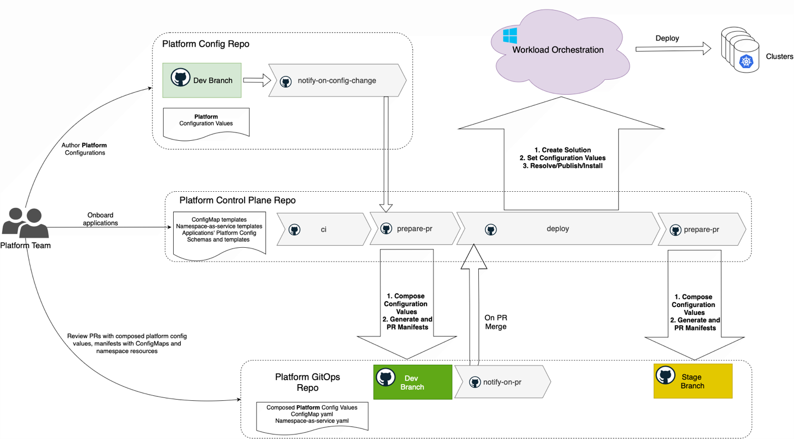

# Workload Orchestration in a Multi-Cluster Environment with GitHub

This article explains how to run a GitHub-driven, "as-code" operating model for deploying and managing applications across many Kubernetes clusters. It introduces the core personas (application vs. platform), the separation of configuration concerns, repository layout, and the automated workflows that promote changes through environments. You’ll learn how this model improves consistency, traceability, velocity, and deployment reliability while preserving clear team boundaries.

## Personas 

Most commonly, two key personas are involved in workload orchestration: the Application Team and the Platform Team. In smaller environments or early stages, these roles may overlap, with the same individuals handling both responsibilities. As the environment grows and complexity increases, the distinction between these roles becomes more defined, enabling clearer separation of concerns and more efficient collaboration. 

## Workload orchestration as code 

Treating workload orchestration "as code" means every desired state (workloads, platform resources, configuration values) lives in Git as the single, versioned source of truth. This delivers consistent primitives and workflows for both application and platform personas: propose a change with a commit/PR, validate it with automated workflows, review/approve, and let automation reconcile runtime state. Key benefits include: auditable history (who changed what, when, and why), easy rollbacks via revert, deterministic and reproducible deployments, reduced configuration drift, enforceable compliance gates, and a shared operating model that lowers hand‑off friction. Using the same Git‑centric experience for all personas aligns tooling, vocabulary, and automation—accelerating iteration while improving reliability and governance.

## Separation of concerns 

Application behavior on a deployment target is determined by configuration values. However, configuration values are not all the same. These values are provided by different personas at different points in the application lifecycle and have different scopes. Generally, there are application and platform configurations. 

Application configurations, defined by the application team, are independent of deployment target specifics. Examples include logging levels, operating modes, and feature flags. These settings are often treated as part of the source code and are typically specified during the packaging phase, when the application is prepared for deployment across multiple environments. 

Platform configurations are defined by the platform team. These settings tailor the runtime behavior of the application for specific deployment targets. Examples include endpoints, resource paths, subscription IDs, Key Vault references, and cluster-specific parameters. Platform configurations ensure that the same application package can operate correctly and securely across diverse clusters and environments. 

Both the application team and the platform team manage their respective configurations in separate GitHub repositories. Automated GitHub Actions workflows monitor these repositories, and when changes are detected, they trigger deployment processes. Using Azure CLI commands, these workflows interact with the Workload Orchestration service to apply application updates and configuration changes across the targeted Kubernetes clusters. 

:::image type="content" source="media/workload-orchestration-git-general.png" alt-text="Diagram showing the general flow of the workload orchestration as code model.":::

## Application Team

The application team oversees the entire software development lifecycle (SDLC) for their applications. They manage and maintain CI/CD pipelines that build container images, generate Kubernetes manifests, and promote deployable artifacts through various environments. Their focus is on delivering application features, ensuring code quality, and enabling smooth deployments, while remaining abstracted from the underlying cluster infrastructure. 

Typically, the application team doesn't know the details of the multi-cluster environment, platform-specific configurations, or the activities of other teams. Their primary measure of success is the outcome of their CI/CD pipeline stages, which indicate whether application deployments and updates have been successfully executed across the entire environment.

Key responsibilities of the application team are: 
 - Develop, build, deploy, test, promote, release, and support their applications. 
 - Maintain and contribute to source, config and manifests repositories of their applications. 
 - Communicate to platform team, requesting configured compute resources for successful SDLC operations 

The software development lifecycle for each application is managed through a system of three dedicated GitHub repositories:

- Application Source Code repository: Stores the application's source code, Dockerfile, and manifest templates (such as Helm charts). It also includes the application configuration schema, configuration templates, and solution specifications.
- Application Config repository: Holds environment-specific configuration values for the application. These settings are application-centric, such as logging levels, replica counts, feature flags, and localization options.
- Application GitOps repository: Stores the composed application configuration values and the fully rendered Kubernetes manifests for each environment. This repository serves as the single source of truth for the desired deployment state, allowing the application team to review, validate, and track exactly what will be deployed to each target cluster. The commit history in this repository provides a complete, auditable record of all deployment changes.

### CI

The `ci` workflow is initiated by a commit to the main branch. It performs standard continuous integration tasks such as code style checks, security scanning, static code analysis, unit testing, and building and pushing Docker images. Upon successful completion, the `ci` workflow triggers the `prepare-pr` workflow, which begins the continuous delivery (CD) process.

### Prepare PR

The `prepare-pr` workflow retrieves Helm manifest templates from the source repository at the specified commit. It then generates Kubernetes manifests by merging these templates with the composed configuration values from the config repository, using the branch that matches the target environment (for example, `dev`). After generating the manifests, the workflow automatically creates a pull request to the corresponding environment branch in the GitOps repository (such as `dev`).

Manual changes to the GitOps repository are not permitted; all pull requests are created exclusively by automated CI/CD workflows. This approach guarantees that every update is traceable to validated changes in the source and config repositories, ensuring consistency, traceability, and compliance transparency. 

Each branch in the GitOps repository corresponds to a specific environment (for example, `dev`, `stage`, or `prod`) and is protected with branch policies and required approvals from designated personas. Additionally, all PRs are subject to automated Kubernetes security and compliance scans before merging, ensuring that only validated and secure configurations are deployed.

### Notify on PR

The `notify-on-pr` workflow is triggered when a pull request containing the rendered manifests is merged into an environment branch (such as `dev`, `stage`, or `prod`) in the GitOps repository. Upon this event, the workflow sends a notification back to the source repository, which acts as the orchestrator for the continuous delivery (CD) process. This notification triggers the `deploy` workflow, initiating the deployment of the validated manifests to the target Kubernetes clusters.

### Deploy 

The `deploy` workflow interacts with the Workload Orchestration service to create a new solution version, apply the composed configuration values, and deploy the solution to the designated clusters. If any cluster reports a deployment failure, the workflow marks the Git commit status in the source repository as failed, halting the entire promotion process.

After deployment, the workflow determines whether the change that initiated the CD process should be promoted to the next environment (if it originated from the `main` branch) and verifies if the next environment is configured. If so, it triggers the `prepare-pr` workflow for the subsequent environment, continuing the promotion cycle. The process ends when there are no further environments in the promotion chain.

### Notify on Config Change

The `notify-on-config-change` workflow is activated when a pull request containing configuration value changes is merged into an environment branch in the config repository. This workflow sends a notification to the source repository, prompting it to regenerate the manifests for the affected environment by invoking the `prepare-pr` workflow with the environment name as a parameter. Because these changes are specific to a single environment, they are not promoted to subsequent environments.

## Platform Team

The platform team operates as a shared service, supporting multiple application teams by managing the underlying Kubernetes clusters and associated infrastructure. Their primary focus is to ensure that clusters are secure, reliable, and properly configured to meet the needs of the applications they host.

Key responsibilities of the platform team include:

- Assigning applications to appropriate clusters across different environments (Dev, Stage, Prod).
- Supplying and maintaining platform and infrastructure configurations required by applications on each cluster.
- Managing and updating platform services and configurations within the clusters.
- Onboarding new clusters into the fleet and overseeing their distribution and lifecycle across environments.
- Facilitating communication and collaboration with application teams to ensure smooth deployment and operation of workloads.

By maintaining a clear separation of concerns, the platform team enables application teams to focus on delivering business value, while ensuring that the underlying infrastructure remains robust and compliant. 
 

The platform team's GitHub repository structure and associated GitHub Actions workflows mirror the setup used by the application team. This system consists of three main repositories:

- Platform Control Plane repository: Stores Helm chart templates for platform resources such as ConfigMaps, namespace-as-a-service components (including service accounts, quotas, limits, and SecretProviderClass), as well as platform configuration schemas and templates.
- Platform Config repository: Contains environment- and cluster-specific platform configuration values.
- Platform GitOps repository: Holds the composed platform configuration values and the rendered manifests for platform resources. This allows the platform team to review and validate the configurations and resources that will be deployed to each cluster.

The platform team deploys platform configurations (such as ConfigMaps) and namespace resources (including service accounts, limits, quotas, and more) as a separate solution, distinct from the application lifecycle. This approach ensures a clear separation of responsibilities and minimizes cross-team dependencies. Key principles include:

- The platform team maintains autonomy over platform resource management, avoiding direct involvement in the application deployment process.
- Platform and application configuration deployments are asynchronous, allowing each team to operate independently. The platform team can update or add configurations without blocking or delaying application deployments, even if some required values are not yet available.
- New platform configurations are made available to applications on clusters immediately after deployment. Applications may consume these updated values as needed, depending on their design and environment, without waiting for the next application deployment cycle.

This model enables rapid iteration and flexibility for both teams, ensuring that platform updates can be delivered promptly while allowing application teams to adopt changes at their own pace. 

## Next Steps

- Sample Implementation (Coming Soon): A detailed walkthrough of a sample implementation will be provided in a separate article. This accelerator will guide you step-by-step through the process of orchestrating workloads across multiple Kubernetes clusters using the Workload Orchestration service and GitHub, helping you understand the practical mechanics and best practices involved.