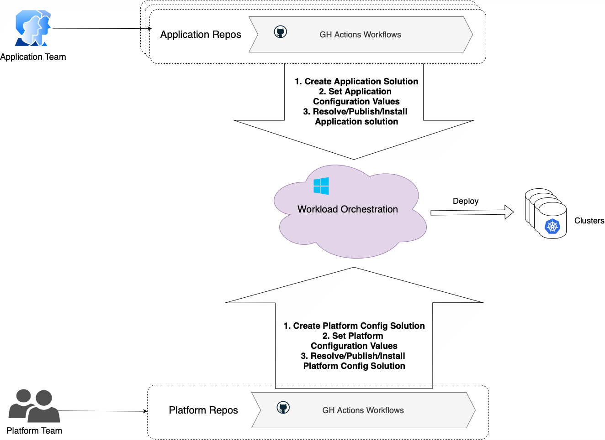
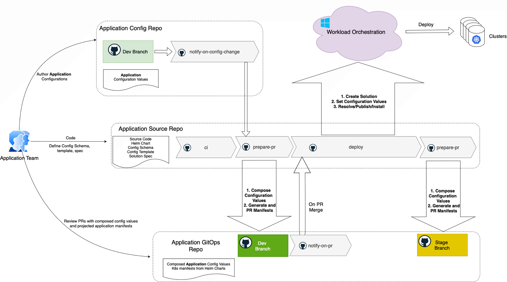
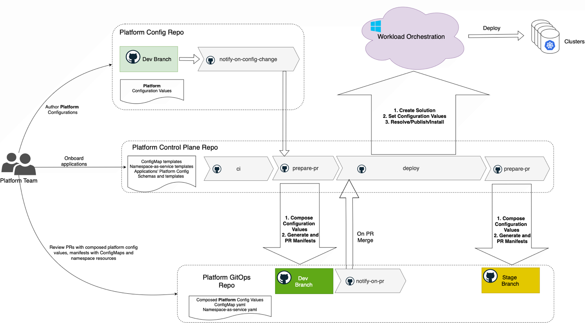

# Workload Orchestration in a Multi-Cluster Environment with Git

This article explains how to orchestrate workloads across multiple Kubernetes clusters using Git as the source of truth, leveraging GitOps principles and Azure Arc. You'll learn the concepts behind multi-cluster orchestration and follow a hands-on tutorial to implement it in your environment.

## Personas 

Most commonly, two key personas are involved in workload orchestration: the Application Team and the Platform Team. In smaller environments or early stages, these roles may overlap, with the same individuals handling both responsibilities. As the environment grows and complexity increases, the distinction between these roles becomes more defined, enabling clearer separation of concerns and more efficient collaboration. 

TODO: add a section anout benefits of using git as a source of truth, "as-code" paradigm and same experiemnce for all involved personas.

## Separation of concerns 

Application behavior on a deployment target is determined by configuration values. However, configuration values are not all the same. These values are provided by different personas at different points in the application lifecycle and have different scopes. Generally, there are application and platform configurations. 

Application configurations, defined by the application team, are independent of deployment target specifics. Examples include logging levels, operating modes, and feature flags. These settings are often treated as part of the source code and are typically specified during the packaging phase, when the application is prepared for deployment across multiple environments. 

Platform configurations are defined by the platform team. These settings tailor the runtime behavior of the application for specific deployment targets. Examples include endpoints, resource paths, subscription IDs, Key Vault references, and environment-specific parameters. Platform configurations ensure that the same application package can operate correctly and securely across diverse clusters and environments. 

Both the application team and the platform team manage their respective configurations in separate GitHub repositories. Automated GitHub Actions workflows monitor these repositories, and when changes are detected, they trigger deployment processes. Using Azure CLI commands, these workflows interact with the Workload Orchestration service to apply application updates and configuration changes across the targeted Kubernetes clusters. 

## Application Team

The application team oversees the entire software development lifecycle (SDLC) for their applications. They manage and maintain CI/CD pipelines that build container images, generate Kubernetes manifests, and promote deployable artifacts through various environments. Their focus is on delivering application features, ensuring code quality, and enabling smooth deployments, while remaining abstracted from the underlying cluster infrastructure. 

Typically, the application team doesn't know the details of the multi-cluster environment, platform-specific configurations, or the activities of other teams. Their primary measure of success is the outcome of their CI/CD pipeline stages, which indicate whether application deployments and updates have been successfully executed across the entire environment.

Key responsibilities of the application team are: 
 - Develop, build, deploy, test, promote, release, and support their applications. 
 - Maintain and contribute to source and manifests repositories of their applications. 
 - Communicate to platform team, requesting configured compute resources for successful SDLC operations 

The software development lifecycle for each application is managed through a system of three dedicated GitHub repositories:

- Application Source Code repository: Stores the application's source code, Dockerfile, and manifest templates (such as Helm charts). It also includes the application configuration schema, configuration templates, and solution specifications.
- Application Config repository: Holds environment-specific configuration values for the application. These settings are application-centric, such as logging levels, replica counts, feature flags, and localization options.
- Application GitOps repository: Contains the composed application configuration values and the rendered application manifests. This enables the application team to review and validate what will be deployed to the target clusters.

TODO: detailed explanation of the flow

## Platform Team
The platform team operates as a shared service, supporting multiple application teams by managing the underlying Kubernetes clusters and associated infrastructure. Their primary focus is to ensure that clusters are secure, reliable, and properly configured to meet the needs of the applications they host.

Key responsibilities of the platform team include:

- Assigning applications to appropriate clusters across different environments (Dev, Stage, Prod).
- Supplying and maintaining platform and infrastructure configurations required by applications on each cluster.
- Managing and updating platform services and configurations within the clusters.
- Onboarding new clusters into the fleet and overseeing their distribution and lifecycle across environments.
- Facilitating communication and collaboration with application teams to ensure smooth deployment and operation of workloads.

By maintaining a clear separation of concerns, the platform team enables application teams to focus on delivering business value, while ensuring that the underlying infrastructure remains robust and compliant. 
 

The system of GitHub repositories for the platform team is symmetrical to the application repositories setup. There are three repositories: 

- Platform Control Plane repository: Stores Helm chart templates for platform resources such as ConfigMaps, namespace-as-a-service components (including service accounts, quotas, limits, and SecretProviderClass), as well as platform configuration schemas and templates.
- Platform Config repository: Contains environment- and cluster-specific platform configuration values.
- Platform GitOps repository: Holds the composed platform configuration values and the rendered manifests for platform resources. This allows the platform team to review and validate the configurations and resources that will be deployed to each cluster.

The platform team deploys platform configurations (such as ConfigMaps) and namespace resources (including service accounts, limits, quotas, and more) as a separate solution, distinct from the application lifecycle. This approach ensures a clear separation of responsibilities and minimizes cross-team dependencies. Key principles include:

- The platform team maintains autonomy over platform resource management, avoiding direct involvement in the application deployment process.
- Platform and application configuration deployments are asynchronous, allowing each team to operate independently. The platform team can update or add configurations without blocking or delaying application deployments, even if some required values are not yet available.
- New platform configurations are made available to applications on clusters immediately after deployment. Applications may consume these updated values as needed, depending on their design and environment, without waiting for the next application deployment cycle.

This model enables rapid iteration and flexibility for both teams, ensuring that platform updates can be delivered promptly while allowing application teams to adopt changes at their own pace. 

 