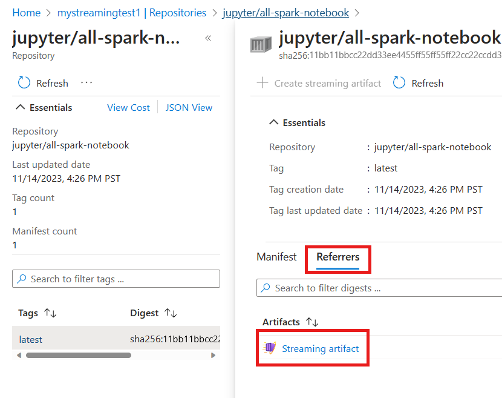

# Artifact streaming in Azure Container Registry (Preview)

Artifact streaming (preview) is a feature in Azure Container Registry that allows you to store and manage container images within a single registry, then stream the container images to Azure Kubernetes Service (AKS) clusters in multiple regions. This feature is designed to accelerate containerized workloads for Azure customers using AKS. With artifact streaming, you can scale workloads without having to wait for slow pull times for your node.

> [!IMPORTANT]
> Artifact streaming is currently in PREVIEW.
> See the [Supplemental Terms of Use for Microsoft Azure Previews](https://azure.microsoft.com/support/legal/preview-supplemental-terms/) for legal terms that apply to Azure features that are in beta, preview, or otherwise not yet released into general availability.

## Use cases

Customers with new and existing registries can start artifact streaming for specific repositories or tags. You can store both the original and the streaming artifact in the same container registry. You maintain access to the original and the streaming artifact even after turning off artifact streaming.

Here are few scenarios where artifact streaming can be beneficial:

**Deploying containerized applications to multiple regions**: With artifact streaming, you can store container images within a single registry and stream them to AKS clusters in multiple regions.

**Reducing image pull latency**: Artifact streaming can reduce time-to-pod readiness by over 15%, depending on the size of the image. This reduction is especially helpful for images that are larger than 30 GB. This feature reduces image pull latency and helps containers start up faster.

**Effective scaling of containerized applications**:  Artifact streaming makes it easier to design, build, and deploy containerized applications at a high scale.

## Availability and pricing information

Artifact streaming is currently available only for the **Premium** [service tier](container-registry-skus.md) (SKU).

Use of artifact streaming may increase overall registry storage consumption. If  consumption exceeds the included 500 GiB Premium SKU threshold, you may be subject to additional charges, as outlined in our [pricing](https://azure.microsoft.com/pricing/details/container-registry/).

## Preview limitations and requirements

Artifact streaming is currently in preview. The following limitations apply:

* Only images with Linux AMD64 architecture are supported in the preview release.
* The preview release doesn't support Windows-based container images and ARM64 images.
* The preview release partially supports multi-architecture images; only the AMD64 architecture is supported.
* For creating Ubuntu based node pool in AKS, you must use Ubuntu version 20.04 or higher.
* For Kubernetes, you must use Kubernetes version 1.26 or higher.
* CMK (Customer-Managed Keys) registries aren't currently supported.
* Kubernetes `regcred` isn't currently supported.

Use the [Azure portal](https://portal.azure.com/) or the Azure CLI to manage artifact streaming. For Azure CLI, you can use the [Azure Cloud Shell][Azure Cloud Shell] or a local installation of the Azure CLI to run the command examples in this article. To install or upgrade, see [Install Azure CLI][Install Azure CLI]. We recommend using the latest version of the Azure CLI. The commands in this article require Azure CLI version 2.54.0 or above.

> [!NOTE]
> If you use artifact streaming with a [soft delete policy](container-registry-soft-delete-policy.md) enabled, and you delete an artifact, both the original and artifact streaming versions are deleted. However, only the original version can be [viewed or restored](container-registry-soft-delete-policy.md#view-and-restore-soft-deleted-artifacts) during the retention period.

## Enable artifact streaming

Start artifact streaming to enable pushing, importing, and generating streaming artifacts for container images in an Azure container registry. These instructions outline the process for creating a *Premium* [SKU](container-registry-skus.md) registry, importing an image, generating a streaming artifact, and managing the artifact streaming operation. Make sure to replace the placeholders with your actual values where necessary.

# [Azure CLI](#tab/azure-cli)

Start artifact streaming by following these general steps:

>[!NOTE]
> If you already have a premium container registry, you can skip this step. If the user is on Basic of Standard SKUs, the following commands will fail. 
> The code is written in Azure CLI and can be executed in an interactive mode. 
> Please note that the placeholders should be replaced with actual values before executing the command.

1. Create a new Azure Container Registry (ACR) using the premium SKU through:

    For example, run the [az group create][az-group-create] command to create an Azure Resource Group with name `my-streaming-test` in the West US region and then run the [az acr create][az-acr-create] command to create a premium Azure Container Registry with name `mystreamingtest` in that resource group.

    ```azurecli-interactive
    az group create -n my-streaming-test -l westus
    az acr create -n mystreamingtest -g my-streaming-test -l westus --sku premium
    ```

1. Push or import an image to the registry through:

    For example, run the [az configure] command to configure the default ACR and [az acr import][az-acr-import] command to import a Jupyter Notebook image from Docker Hub into the `mystreamingtest` ACR.

    ```azurecli-interactive
    az configure --defaults acr="mystreamingtest"
    az acr import --source docker.io/jupyter/all-spark-notebook:latest -t jupyter/all-spark-notebook:latest
    ```

1. Create an artifact streaming from the Image

   Initiates the creation of a streaming artifact from the specified image.

   For example, run the [az acr artifact-streaming create][az-acr-artifact-streaming-create] commands to create a streaming artifact from the `jupyter/all-spark-notebook:latest` image in the `mystreamingtest` ACR.

   ```azurecli-interactive
   az acr artifact-streaming create --image jupyter/all-spark-notebook:latest
   ```

   >[!NOTE]
   > An operation ID is generated during the process for future reference to verify the status of the operation.

1. Verify the generated artifact streaming in the Azure CLI.

   For example, run the [az acr manifest list-referrers][az-acr-manifest-list-referrers] command to list the streaming artifacts for the `jupyter/all-spark-notebook:latest` image in the `mystreamingtest` ACR.

   ```azurecli-interactive
   az acr manifest list-referrers -n jupyter/all-spark-notebook:latest
   ```

1. Cancel the artifact streaming creation (if needed)

   Cancel the streaming artifact creation if the conversion isn't finished yet. It stops the operation.

   For example, run the [az acr artifact-streaming operation cancel][az-acr-artifact-streaming-operation-cancel] command to cancel the conversion operation for the `jupyter/all-spark-notebook:latest` image in the `mystreamingtest` ACR.

   ```azurecli-interactive
   az acr artifact-streaming operation cancel --repository jupyter/all-spark-notebook --id c015067a-7463-4a5a-9168-3b17dbe42ca3
   ```

1. Start autoconversion on the repository

   Start autoconversion in the repository for newly pushed or imported images. When started, new images pushed into that repository trigger the generation of streaming artifacts.

   >[!NOTE]
    > Auto-conversion does not apply to existing images. Existing images can be manually converted.

    For example, run the [az acr artifact-streaming update][az-acr-artifact-streaming-update] command to start autoconversion for the `jupyter/all-spark-notebook` repository in the `mystreamingtest` ACR.

    ```azurecli-interactive
    az acr artifact-streaming update --repository jupyter/all-spark-notebook --enable-streaming true
    ```

1. Verify the streaming conversion progress, after pushing a new image `jupyter/all-spark-notebook:newtag` to the above repository.

   For example, run the [az acr artifact-streaming operation show][az-acr-artifact-streaming-operation-show] command to check the status of the conversion operation for the `jupyter/all-spark-notebook:newtag` image in the `mystreamingtest` ACR.

   ```azurecli-interactive
   az acr artifact-streaming operation show --image jupyter/all-spark-notebook:newtag
   ```

1. Once you have verified conversion status, you can now connect to AKS. Refer to [AKS documentation](https://aka.ms/artifactstreaming).

1. Turn off the streaming artifact from the repository.

   For example, run the [az acr artifact-streaming update][az-acr-artifact-streaming-update] command to delete the streaming artifact for the `jupyter/all-spark-notebook:latest` image in the `mystreamingtest` ACR.

   ```azurecli-interactive
   az acr artifact-streaming update --repository jupyter/all-spark-notebook --enable-streaming false
   ```

# [Azure portal](#tab/azure-portal)

Follow the steps to create artifact streaming in the [Azure portal](https://portal.azure.com). 

1. Navigate to your Azure Container Registry. 

1. In the side **Menu**, under the **Services**, select **Repositories**.

1. Select the latest imported image.

1. Convert the image and create artifact streaming in Azure portal.

   > [!div class="mx-imgBorder"]
   > [](./media/container-registry-artifact-streaming/01-create-artifact-streaming-expanded.png#lightbox)

1. Check the streaming artifact generated from the image in Referrers tab.     

   > [!div class="mx-imgBorder"]
   > [](./media/container-registry-artifact-streaming/02-artifact-streaming-generated-expanded.png#lightbox)

In the Azure portal, you can change a repository's autoconversion status by right-clicking it from the **Repositories** pane. Select **Stop artifact streaming** to change its **Artifact streaming** status to **Inactive**, or **Start artifact streaming** to change its **Artifact streaming** status to **Active**.

---

> [!NOTE]
> The state of artifact streaming in a repository (inactive or active) determines whether newly pushed compatible images will be automatically converted. By default, all repositories are in an inactive state for artifact streaming. This means that when new compatible images are pushed to the repository, artifact streaming will not be triggered, and the images will not be automatically converted. If you want to start automatic conversion of newly pushed images, you need to set the repository's artifact streaming to the active state. Once the repository is in the active state, any new compatible container images that are pushed to the repository will trigger artifact streaming. This will start the automatic conversion of those images.

>[!NOTE]
> Artifact streaming can work across regions, regardless of whether geo-replication is started or not.
> Artifact streaming can work through a private endpoint and attach to it.


## Next steps

> [!div class="nextstepaction"]
> [Troubleshoot Artifact streaming](troubleshoot-artifact-streaming.md)

<!-- LINKS - External -->
[Install Azure CLI]: /cli/azure/install-azure-cli
[Azure Cloud Shell]: /azure/cloud-shell/quickstart
[az-group-create]: /cli/azure/group#az-group-create
[az-acr-import]: /cli/azure/acr#az-acr-import
[az-acr-artifact-streaming-create]: /cli/azure/acr/artifact-streaming#az-acr-artifact-streaming-create
[az-acr-manifest-list-referrers]: /cli/azure/acr/manifest#az-acr-manifest-list-referrers
[az-acr-create]: /cli/azure/acr#az-acr-create
[az-acr-artifact-streaming-operation-cancel]: /cli/azure/acr/artifact-streaming/operation#az-acr-artifact-streaming-operation-cancel
[az-acr-artifact-streaming-operation-show]: /cli/azure/acr/artifact-streaming/operation#az-acr-artifact-streaming-operation-show
[az-acr-artifact-streaming-update]: /cli/azure/acr/artifact-streaming#az-acr-artifact-streaming-update
