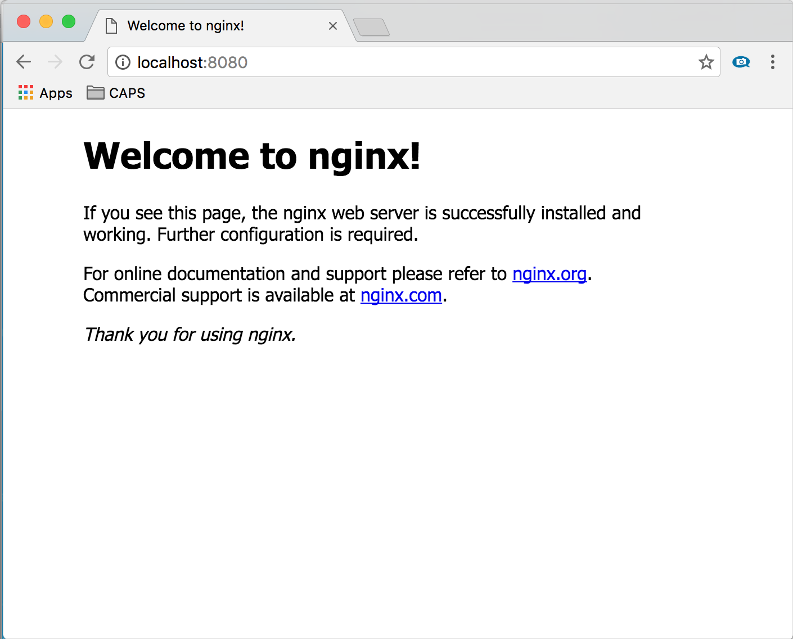

# Push your first image to your Azure container registry by using the Docker CLI

An Azure container registry stores and manages private container images and other artifacts, similar to the way [Docker Hub](https://hub.docker.com/) stores public Docker container images. You can use the [Docker command-line interface](https://docs.docker.com/engine/reference/commandline/cli/) (Docker CLI) for [login](https://docs.docker.com/engine/reference/commandline/login/), [push](https://docs.docker.com/engine/reference/commandline/push/), [pull](https://docs.docker.com/engine/reference/commandline/pull/), and other container image operations on your container registry.

In the following steps, you download a public [Nginx image](https://store.docker.com/images/nginx), tag it for your private Azure container registry, push it to your registry, and then pull it from the registry.

## Prerequisites

* An Azure subscription. If you don't have an Azure subscription, [create a free account](https://azure.microsoft.com/pricing/purchase-options/azure-account?cid=msft_learn) before you begin.
* An Azure container registry in your Azure subscription. You can create one by using the [Azure portal](container-registry-get-started-portal.md), the [Azure CLI](container-registry-get-started-azure-cli.md), or [Azure PowerShell](container-registry-get-started-powershell.md).
* You must also have Docker installed locally. Docker provides packages that easily configure Docker on any [macOS][docker-mac], [Windows][docker-windows], or [Linux][docker-linux] system.

## Sign in to your container registry

There are [several ways to authenticate](container-registry-authentication.md) to your container registry.

### [Azure CLI](#tab/azure-cli)

The recommended method when working in a command line is by using the Azure CLI command [az acr login](/cli/azure/acr#az-acr-login). To access a registry named `myregistry`, sign into the Azure CLI and then authenticate to your registry:

```azurecli
az login
az acr login --name myregistry
```

### [Azure PowerShell](#tab/azure-powershell)

The recommended method when working in PowerShell is with the Azure PowerShell cmdlet [Connect-AzContainerRegistry](/powershell/module/az.containerregistry/connect-azcontainerregistry). For example, to log in to a registry named *myregistry*, sign into Azure and then authenticate to your registry:

```azurepowershell
Connect-AzAccount
Connect-AzContainerRegistry -Name myregistry
```

---

You can also sign in by using [docker login](https://docs.docker.com/reference/cli/docker/login/). For best practices to manage authentication credentials, see the [docker login](https://docs.docker.com/reference/cli/docker/login.) command reference
.

For example, you might have [assigned a service principal](container-registry-authentication.md#service-principal) to your registry for an automation scenario. When you run the following command, interactively provide the service principal appID (username) and password when prompted:

```
docker login myregistry.azurecr.io
```

> [!TIP]
> Always specify the fully qualified registry name (all lowercase) when you use `docker login` and when you tag images for pushing to your registry. In the examples in this article, the fully qualified name is *myregistry.azurecr.io*.

## Pull a public Nginx image

First, pull a public Nginx image to your local computer. This example pulls the [official Nginx image](https://hub.docker.com/_/nginx/).

```
docker pull nginx
```

## Run the container locally

Use the [docker run](https://docs.docker.com/engine/containers/run/) command to start a local instance of the Nginx container interactively (`-it`) on port 8080. The `--rm` argument specifies that the container should be removed when you stop it.

```
docker run -it --rm -p 8080:80 nginx
```

Browse to `http://localhost:8080` to view the default web page served by Nginx in the running container. You should see a page similar to the following:



Because you started the container interactively with `-it`, you can see the Nginx server's output on the command line after navigating to it in your browser.

To stop and remove the container, press `Ctrl`+`C`.

## Create an alias of the image

Use [docker tag](https://docs.docker.com/reference/cli/docker/image/tag/) to create an alias of the image with the fully qualified path to your registry. This example specifies the `samples` namespace to avoid clutter in the root of the registry.

```
docker tag nginx myregistry.azurecr.io/samples/nginx
```

For more information about tagging with namespaces, see the repository namespaces best practices](container-registry-best-practices.md#repository-namespaces).

## Push the image to your registry

Now that you've tagged the image with the fully qualified path to your private registry, you can push it to the registry with [docker push](https://docs.docker.com/reference/cli/docker/image/push/):

```
docker push myregistry.azurecr.io/samples/nginx
```

## Pull the image from your registry

Use the [docker pull](https://docs.docker.com/reference/cli/docker/image/pull/) command to pull the image from your registry:

```
docker pull myregistry.azurecr.io/samples/nginx
```

## Start the Nginx container

Use the [docker run](https://docs.docker.com/engine/containers/run/) command to run the image you pulled from your registry:

```
docker run -it --rm -p 8080:80 myregistry.azurecr.io/samples/nginx
```

Browse to `http://localhost:8080` to view the running container.

To stop and remove the container, press `Ctrl`+`C`.

## Remove the image (optional)

If you no longer need the Nginx image, you can delete it locally with the [docker rmi](https://docs.docker.com/reference/cli/docker/image/rm/) command.

```
docker rmi myregistry.azurecr.io/samples/nginx
```

### [Azure CLI](#tab/azure-cli)

To remove images from your Azure container registry, use [`az acr repository delete`](/cli/azure/acr/repository#az-acr-repository-delete). For example, the following command deletes the manifest referenced by the `samples/nginx:latest` tag, any unique layer data, and all other tags referencing the manifest.

```azurecli
az acr repository delete --name myregistry --image samples/nginx:latest
```

### [Azure PowerShell](#tab/azure-powershell)

The [Az.ContainerRegistry](/powershell/module/az.containerregistry) Azure PowerShell module contains multiple commands for removing images from your container registry. [Remove-AzContainerRegistryRepository](/powershell/module/az.containerregistry/remove-azcontainerregistryrepository) removes all images in a particular namespace, such as `samples/nginx`, while [Remove-AzContainerRegistryManifest](/powershell/module/az.containerregistry/remove-azcontainerregistrymanifest) removes a specific tag or manifest.

In the following example, you use the `Remove-AzContainerRegistryRepository` cmdlet to remove all images in the `samples/nginx` namespace.

```azurepowershell
Remove-AzContainerRegistryRepository -RegistryName myregistry -Name samples/nginx
```

In the following example, you use the `Remove-AzContainerRegistryManifest` cmdlet to delete the manifest referenced by the `samples/nginx:latest` tag, any unique layer data, and all other tags referencing the manifest.

```azurepowershell
Remove-AzContainerRegistryManifest -RegistryName myregistry -RepositoryName samples/nginx -Tag latest
```

---

## Next steps

Now that you know the basics, you're ready to start using your registry. For example, deploy container images from your registry to:

* [Azure Kubernetes Service (AKS)](/azure/aks/tutorial-kubernetes-prepare-app)
* [Azure Container Instances](/azure/container-instances/container-instances-tutorial-prepare-app)
* [Service Fabric](/azure/service-fabric/service-fabric-tutorial-create-container-images)

<!-- LINKS - external -->
[docker-linux]: https://docs.docker.com/desktop/install/linux-install/
[docker-mac]: https://docs.docker.com/desktop/install/mac-install/
[docker-windows]: https://docs.docker.com/desktop/install/windows-install/
