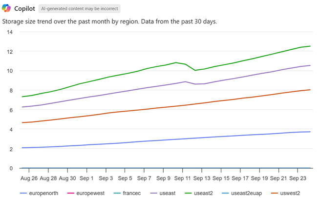
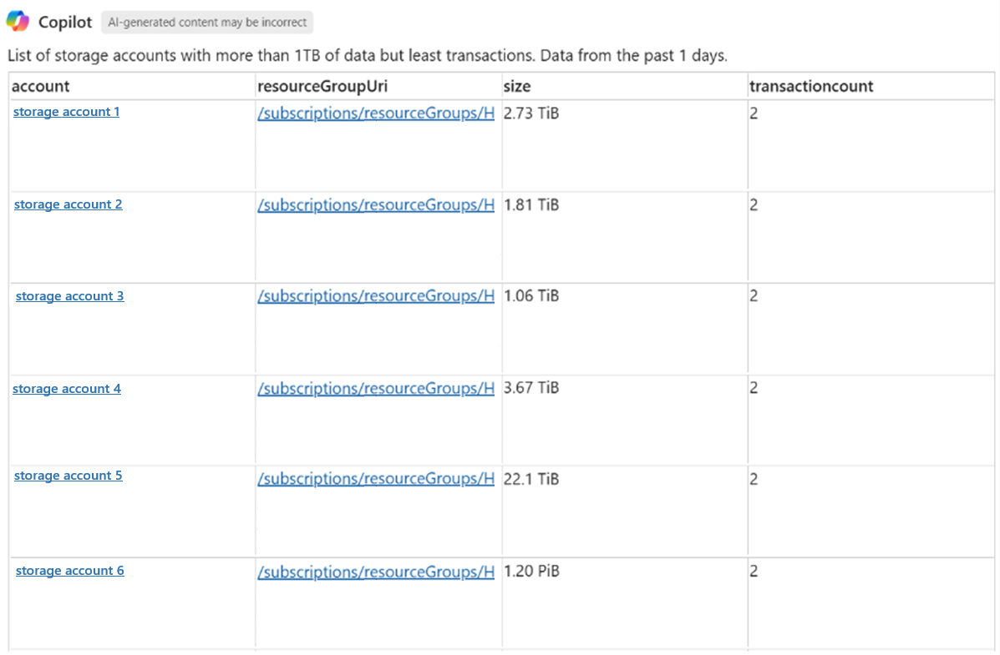
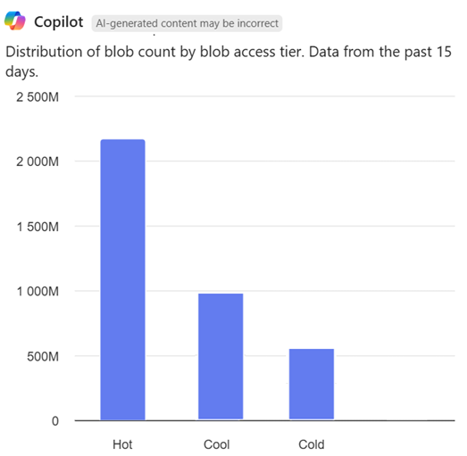
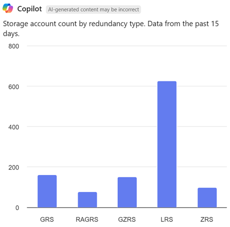

# Discover insights about your Azure Storage estate with Azure Storage Discovery and the Azure Copilot

[Azure Storage Discovery](/azure/storage-discovery/overview) is a managed service that gives you **enterprise-wide visibility** into your Azure Blob Storage data estate. It helps you track how your data is growing, uncover opportunities for **cost optimization**, and check if your storage configurations follow **security best practices**. With Azure Storage Discovery, you can analyze thousands of storage accounts across subscriptions and regions from one place, using prebuilt reports and interactive dashboards. 

**Azure Copilot integration takes Storage Discovery a step further** by letting you ask questions about your storage data in natural language and get instant, visual answers. Instead of writing Kusto queries or combing through logs, you can chat with Azure Copilot to explore your storage insights. Copilot understands your questions, retrieves the relevant aggregated data from Storage Discovery, and presents results as dynamic charts or tables directly in the Azure portal. This conversational approach makes it easier for anyone – from IT managers to storage admins – to gain insights and make data-driven decisions.

## Interacting with Azure Copilot in Storage Discovery

Retrieving storage insights with the Azure Copilot requires a deployment of the [Storage Discovery service](/azure/storage-discovery/deployment-planning). Deploying the service means [creating a Discovery workspace resource](/azure/storage-discovery/create-workspace) Having a workspace starts the data aggregation required to answer certain storage-insights related questions to the Azure Copilot.

To start using Copilot, navigate to your Azure Storage Discovery workspace in the Azure portal. On the workspace overview or insights page, look for the **Copilot** icon. Open the Copilot chat interface.

Example: You might ask "*Show me the trend of my storage usage over time.*" Copilot interprets your question, queries the Storage Discovery data, and responds with the requested insight. You can request to receive the answer as a table or a specific type of chart.

> [!TIP]
> Asking the Azure Copilot about your storage estate requires you to select a Storage Discovery workspace. You need to deploy this resource first before Copilot has the data to answer your questions.

## Identify cost optimization opportunities

Cost optimization is often the first concern when managing a large storage estate. Azure Storage Discovery’s reports already show you metrics like total capacity and data growth trends. With Copilot, you can dig deeper or customize these insights with simple questions.

**Analyze storage growth trends:** Ask Copilot about how your stored data is trending over time. For example: "*How is the storage size trending over the past month by region?*" Copilot returns a line chart plotting the total data size in your storage accounts over the last month, broken down by region. This visualization helps you see which regions are contributing most to growth or if any region’s usage is flattening or spiking.

<!-- Source document: Page 3 -->

**Find under-utilized storage (cold data):** Storing much data in a hot tier that isn’t being accessed could waste money. You can have Copilot identify storage accounts with large capacity but low activity. For example: "*Provide a table of storage accounts that have the least transactions and are above 1 TiB in size.*" This prompt asks for a list of large storage accounts with minimal access. Copilot returns a table with storage accounts meeting those conditions. The result table includes columns like the account name, data size, and the number of transactions. You can immediately spot accounts that each hold over 1 TiB of data but handle few transactions. Such accounts might be good candidates to move to a cooler access tier (like Cool or Archive) to save costs.

<!-- Source document: Page 4 -->

**View data distribution by access tier:** To act on cold data, you might want to know how your data is currently distributed across access tiers (Hot, Cool, Cold, Archive). You can ask a question like: "*Show me a distribution of blob count by blob access tier.*" In response, Copilot can provide a bar chart (or pie chart) breaking down how many blobs are in each access tier across your estate. If you discover that a large number of blobs are in the Hot tier even though they're rarely accessed, that indicates an opportunity to use [lifecycle management policies](/azure/storage/blobs/lifecycle-management-policy-configure) or [**Azure Storage Actions**](/azure/storage-actions/overview) to automatically move data to cheaper tiers over time.

<!-- Source document: Page 5 -->

Using Copilot in this way can quickly surface **where your storage costs are coming from**. It turns what could be a complex query (combining capacity and transaction data across many accounts) into an easy question and answer. The visual results make it straightforward to decide on next steps, such as enabling rules to **tier down infrequently used data** and reduce costs.

## Assess security configurations & compliance

Another key value of Storage Discovery is surfacing potential security risks or misconfigurations in your storage accounts. For example, it can tell you which accounts allow anonymous access or still use access keys for authentication. With Copilot, you can interactively query these security insights and even get summaries or breakdowns by region or other dimensions.

**Detect usage of shared access keys:** Microsoft recommends using Microsoft Entra ID with managed identities for Azure Storage authentication whenever possible, rather than shared keys. To ensure compliance, you can ask Copilot something like: "*How many of my storage accounts have `shared access keys` enabled?*" Copilot might respond with a simple count or a list. You can refine the question to get a regional breakdown: "*Show me a pie chart of my storage accounts with shared key enabled, by region.*" Copilot produces a **pie chart** where each slice represents a region, showing what portion of accounts in that region still allows shared key authentication. 

<!-- Source document: Page 6 -->

This insight is useful when one region has a large slice, which means many accounts there still use shared keys. You might prioritize those regions for rolling out Entra ID authentication. The Copilot result helps focus your efforts on the biggest problem areas first.

**Check other security settings:** You can query settings like `anonymous public access` or `Minimum required TLS version`. For example: "*List storage accounts that allow anonymous public read access.*" Copilot can return a list of any accounts with that setting enabled, so you can review if this setting is needed on those accounts. Or you might ask: "*Which storage accounts aren't enforcing encryption at rest?*" (All Azure storage accounts have encryption at rest enabled by default, but if any accounts was misconfigured, Copilot would highlight that.)

## Manage data redundancy and resiliency

Azure Storage offers several redundancy options (LRS, ZRS, GRS, etc.). Storage Discovery’s reports show the distribution of accounts across these redundancy settings. Azure Copilot can help you analyze redundancy configurations and even consider potential optimizations:

**View redundancy distribution:** You might ask Copilot: "*Show me a distribution of my storage account count by redundancy option.*" Copilot returns a chart (for instance a bar chart) with each redundancy level on the X-axis and the number of storage accounts on the Y-axis. This representation quickly tells you how many accounts use Locally Redundant Storage (LRS) vs Zone Redundant (ZRS) vs Geo-Redundant (GRS), etc.

<!-- Source document: Page 7 -->

Suppose the chart reveals that, 80% of accounts are LRS and only a few use ZRS. In case these accounts support critical workloads then they all benefit from ZRS redundancy. This insight lets you verify if those resources are configured correctly. Alternatively, if many accounts are using ZRS but don’t actually need that level of resiliency, you might consider downgrading some to LRS to save costs. Copilot’s visualization **highlights potential misalignments** between your redundancy choices and your resiliency needs.

**Ask for specific insights:** You can combine filters in your question. For example: "*Which storage accounts are using GRS in the West US region?"* and Copilot lists them. Or *"Do I have any storage accounts with only LRS in East US 2?*" to find where you might want to upgrade redundancy.

By querying redundancy information on-demand, you ensure your storage accounts’ configuration meets your **disaster recovery and availability targets**. Copilot basically turns the raw configuration data into an actionable summary for you.

## Tips for getting the best results from Copilot

**Be specific in your prompts:** While Copilot can handle natural language, phrasing your question clearly yields better answers. Include what insight you want and any filter (time range, region, tier, etc.) in your question. For example: "How is storage usage changing?" is okay, but "How is storage size trending **over the past 30 days** by **region**?" is more likely to produce the detailed chart you want.

**Request a visualization if helpful:** Copilot decides the format of the answer (it might choose a table, chart, or just text). You can guide it by mentioning a format. For instance, adding "*show me a pie chart of…*" or "*provide a table of…*" to your prompt usually influences Copilot to return an answer in that format.

**Use follow-up questions:** Copilot remembers the context within the session. You can ask a broad question first, then follow up with a more specific one without restating everything. For example: "*How many storage accounts do we have?*" Copilot might say "200 accounts across X regions." Then you ask: "*How many are in North Europe?*" – Copilot knows you’re still talking about storage account count and filters to answer in that context.

**Understand limitations:** Storage Discoveries Azure Copilot extension is focused on analytics reporting, not operational tasks. You can't use the Discovery Copilot extension to create resources or change resource configuration.

## How Copilot enhances the Storage Discovery experience

- You get **on-demand insights** beyond the fixed dashboards. If a certain metric or combination isn’t directly shown in the UI of a Discovery workspace report, you can ask Copilot for it.
- It **democratizes access** to insights. Team members who are less familiar with Azure can still retrieve insights by asking for them. Insights that would otherwise require complex queries or scripting.
- The interactive nature encourages exploration. You might start with one question and, seeing the result, ask a follow-up or drill-down question. This conversational analysis can lead to findings you might skip if you had to write complex queries each time.
- Azure Copilot answers are based on the same underlying data as the Azure portal dashboards. You can cross-verify any Copilot answer with the relevant report in the Storage Discovery workspace.

In summary, Azure Copilot makes Azure Storage Discovery more **powerful and user-friendly**. It brings your data to your fingertips, whether you’re investigating cost spikes, tightening security, or planning backup strategies. By using natural language and AI-driven visualizations, you can derive more value from your storage insights with less effort.

## Next steps

After understanding the great opportunities with Storage Discovery in the Azure Copilot, it's a good idea to get more familiar with the Storage Discovery service.

- [Get an overview of the Discovery service](/azure/storage-discovery/overview)
- [Plan your Storage Discovery deployment](/azure/storage-discovery/deployment-planning)
- [Create a Storage Discovery workspace](/azure/storage-discovery/create-workspace)
